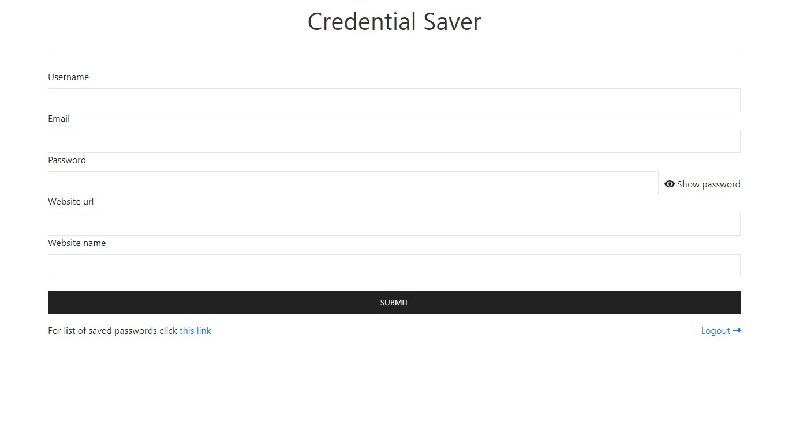
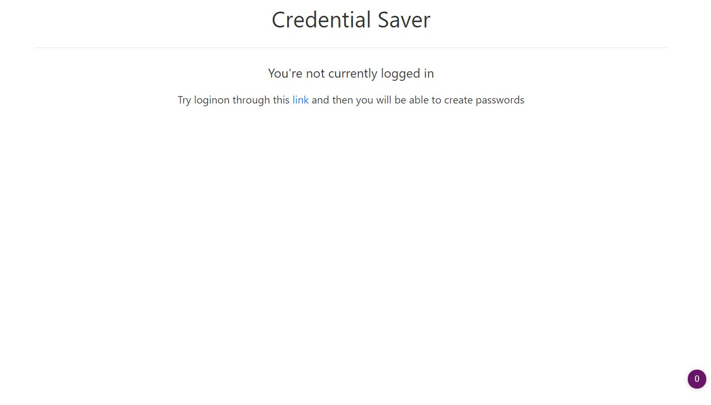

<div align=center></span></div>

# Credential Saver

<br>

## Description

___
Save your login credentials incase you forget them

<br>

## Requirements

___

1. `Python` >=3.5 or `Anaconda` (optional)
2. pip modules (`django`, `pscopg2`)
3. PostgreSQL installed with database set up already (optional - best peformance)

<br>

## Installation / Usage

___

## Anaconda

1. Clone this repository with command `git clone https://github.com/LokotamaTheMastermind/secret-password-saver-development.git`
2. Enter the folder with anaconda enabled and in `base` virtual environment
3. Change the directory to `scripts/{op}`, where `{op}` is your operating system listed. Then after run the `install` script for that operating system
4. Wait for project server to startup
5. Then open browser in url `127.0.0.1:100`

## PIP

1. Clone this repository with command `git clone https://github.com/LokotamaTheMastermind/secret-password-saver-development.git`
2. Activate your virtualenv if you have any
3. Change directory to `scripts/{op}` where `{op}` is your operating system. Then run the file `install_pip.bat` in cmd
4. Wait tfor the project server to startup
5. Then open browser in url `127.0.0.1`

<br>

**Important Notice** - I suggest you read further for information about configuring the project

<br>

## Configuration

### Database

___
If you want to configure the database option in the `settings.py` in the `src/PasswordVault` folder

Do the following

```python
DATABASES = {
    'default': {
        'ENGINE': 'django.db.backends.sqlite3',
        'NAME': BASE_DIR / 'db.sqlite3',
    }
}
```

to this

```python
DATABASES = {
    'default': {
        'ENGINE': 'django.db.backends.postgresql',
        'NAME': 'database_name',
        'USER': 'database_user',
        'PASSWORD': 'database_password',
        'HOST': 'database_host',
        'PORT': 'database_port',
    }
}
```

If you leave the configuration the way it is you go with default which doesn't need installation

If you change configuration available then you have to fill in with your personal information for postgresql database

<br>

## Screenshots

___




<br>

## License

___
View the license at [LICENSE](LICENSE)

<br>

## Contributing

___
To contributing to the project read the instructions at [CONTRIBUTING](CONTRIBUTING.md)

<br>

## Authors

___
The current project authors are listed in [AUTHORS](AUTHORS.md)